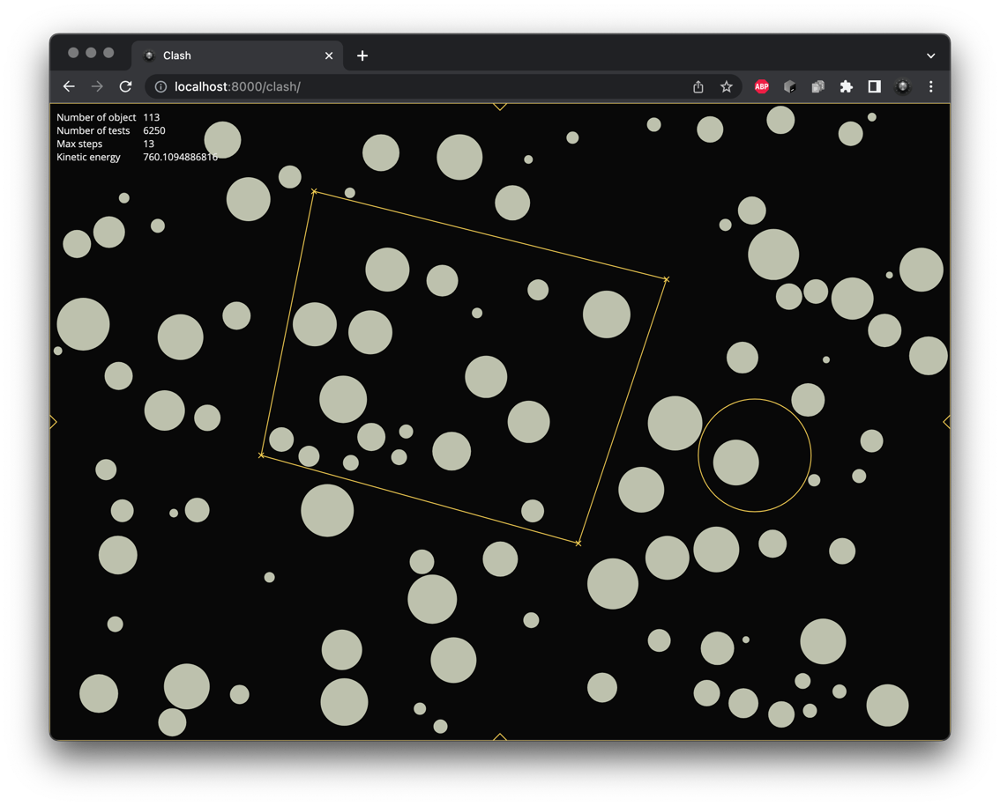

# Clash

A **physics engine** that runs on **dynamic intersection**. It asks mathematically when a contact will occur rather than waiting
for penetrations. In theory, no shapes will ever overlap or tunnel, even at high paces. In practice floating errors might
accumulate and need special treatments.

[Open](https://andremichelle.github.io/clash/)

# Build
Make sure to have sass installed and run in the console:

    sass sass/main.sass:bin/main.css --watch

Make sure to have typescript installed and run in the console:

    tsc -p ./typescript/tsconfig.json --watch

# Todo

* Introduce gravity and resistance
* Find solution for resting contacts (prevent permanent jumping)
* Introduce moving particles
* Introduce ~~**fixed** polygons, circles~~, and circle segments